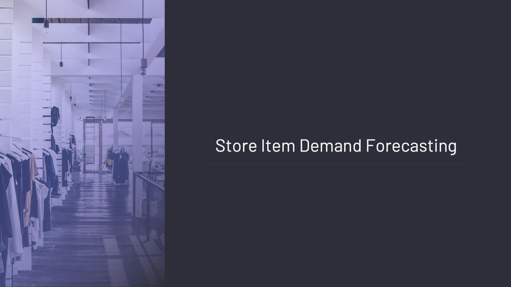

# Store Item Demand Forecasting

This repo contains notebooks on time series and forecasting with machine learning



# Business Problem

The objective of this competition is to predict 3 months of item-level sales data at different store locations.

# Dataset Info

5 Feature, 958000 Sample

| Features | Definition |
| --- | --- |
| date | Date of the sale data. There are no holiday effects or store closures. |
| store | Store ID |
| item | Item ID |
| sales | Number of items sold at a particular store on a particular date. |

# Requirements

```
lightgbm==3.1.1
matplotlib==3.5.2
numpy==1.22.3
pandas==1.4.4
scikit_learn==1.1.2
seaborn==0.11.2
statsmodels==0.13.2
```

# **Files**

[01_statistical_methods.ipynb](https://github.com/oguzerdo/time-series-approaches/blob/main/01_statistical_methods.ipynb) - Time Series with Statistical Methods 

[02_smoothing_methods.ipynb](https://github.com/oguzerdo/time-series-approaches/blob/main/02_smoothing_methods.ipynb) - Time Series with Smoothing Methods

[03_airline_passengers.ipynb](https://github.com/oguzerdo/time-series-approaches/blob/main/03_airline_passengers.ipynb) - Passenger Forecast with Time Series

[04_demand_forecasting_lgbm.ipynb](https://github.com/oguzerdo/time-series-approaches/blob/main/04_demand_forecasting_lgbm.ipynb) - Demand Forecasting with Machine Learning

# Author

[Oğuz Erdoğan](http://www.oguzerdogan.com)